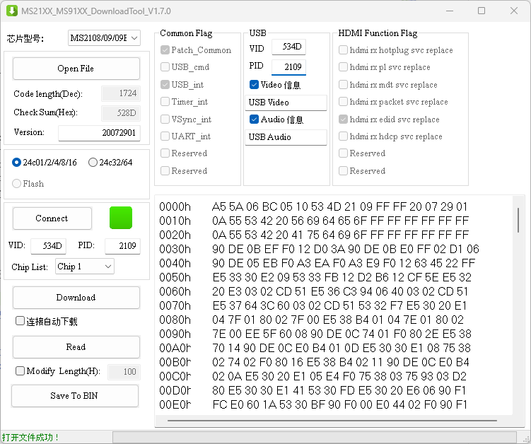

# MacroSilicon MS2109 EEPROM Firmware

## Files

[Original Fimware Dumped from MS2109](MS2109-CLEAN-FIRMWARE.bin)

## Data Format

| Bytes (HEX) | Label          | Example Values                                    | Descrption                                                                                                                                                                                                                                                                                                                                                                                               |
| ----------- | -------------- | ------------------------------------------------- | -------------------------------------------------------------------------------------------------------------------------------------------------------------------------------------------------------------------------------------------------------------------------------------------------------------------------------------------------------------------------------------------------------- |
| 00-01       | EEPROM Type    | `A5 5A` or `96 69`                                | `A5 5A` for 24c01/02/04/08/16, `96 69` for 24c32/64                                                                                                                                                                                                                                                                                                                                                      |
| 06-07       | VID (USB)      | `53 4D`                                           | 2 bytes Vendor ID, `53 4D` is Macro Silicon Vendor ID                                                                                                                                                                                                                                                                                                                                                    |
| 07-08       | PID (USB)      | `21 09`                                           | 2 bytes Product ID, `21 09` is the product id of MS2109                                                                                                                                                                                                                                                                                                                                                  |
| 0C-0F       | Version        | `20 07 29 01`                                     | Version of the firmware                                                                                                                                                                                                                                                                                                                                                                                  |
| 10-1F       | Video (USB)    | `0A 55 53 42 20 56 69 64 65 6F FF FF FF FF FF FF` | First byte is the size of string, follwed by data, example value translates to USB Video                                                                                                                                                                                                                                                                                                                 |
| 20-2F       | Audio (USB)    | `0A 55 53 42 20 41 75 64 69 6F FF FF FF FF FF FF` | First byte is the size of string, follwed by data, example value translates to USB Audio                                                                                                                                                                                                                                                                                                                 |
|             | EEID (Monitor) |                                                   | EEID can be used to change the monitor manufacturer name and serial number, product type, capabilities, etc. EEID is in an arbitary position, search for the header `00 FF FF FF FF FF FF 00` followed by data, which is 256 bytes including the headers. More details on EEID data format can be found [here](https://en.wikipedia.org/wiki/Extended_Display_Identification_Data#EDID_1.4_data_format). |

## Useful Tools

### [MS21XX MS91XX Download Tool](https://mega.nz/file/HfpAnIzB#UY7eqQpnL4wJM2C5Lne6Y_5GpIF37_AqLIG4hosE0sk)

This tool can be used to read/flash the firmware via HID interface.

1. Open File -> Load a firmware from file into the program (does not flash)
1. Connect -> Used to connect capture card if default VID, PID is changed
1. Download -> Flash the loaded firmware to the capture card
1. Read -> Read the firmware that is in your capture card (use this first time and make a backup of your original firmware)
1. Save to BIN -> Save the firmware to file

### [ms-tools](https://github.com/BertoldVdb/ms-tools)

Program, library and reference designs to develop for MacroSilicon MS2106/MS2109/MS2130 chips.

### [HxD](https://mh-nexus.de/en/hxd/)

HxD is a hex editor. It can be used to edit firmware for MS2109.
